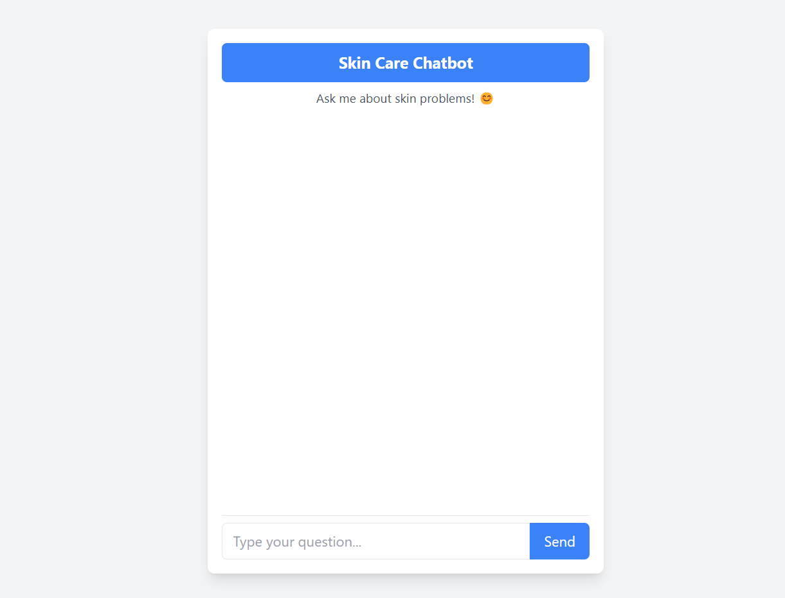
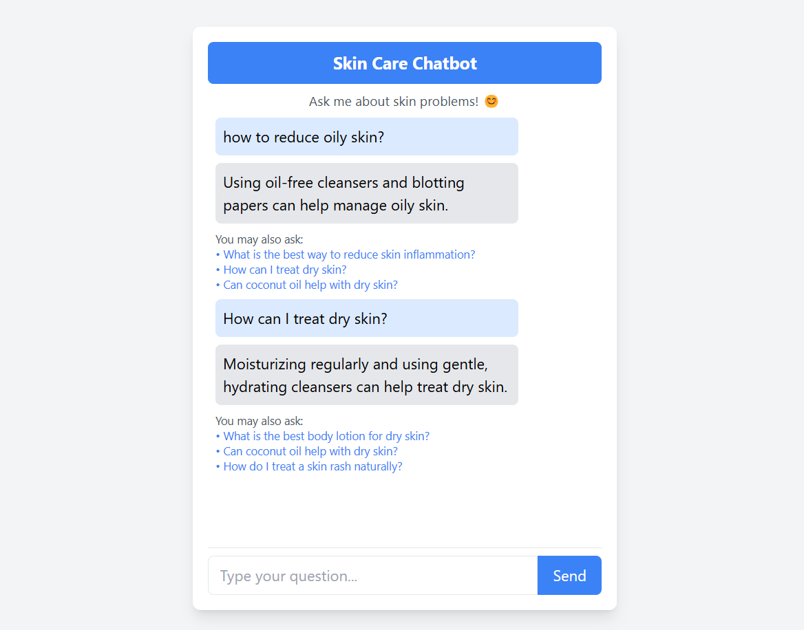

# 🌿 SkinCare-Chatbot




   

## 🏥 About the Project
**SkinCare-Chatbot** is an AI-powered chatbot that provides solutions to skin-related problems using **NLP & Machine Learning**. The chatbot uses **BERT-based sentence transformers** to understand user queries and return the most relevant answers. It also leverages **Named Entity Recognition (NER)** to extract important terms and expand queries for better accuracy. 🚀

## ✨ Features
- 🤖 **AI-Powered Query Matching** (Using `Sentence Transformers`)
- 🔍 **Named Entity Recognition (NER)** for extracting skin-related terms
- 📚 **Synonym Expansion** using `WordNet`
- 📊 **Semantic Similarity Matching**
- 🏥 **Accurate Responses** for common skincare queries
- 📌 **Related Questions Suggestion**
- 🌍 **Web Interface using Flask**

## 🚀 Tech Stack
- **Flask** 🏗️ (Backend Web Framework)
- **Pandas** 🐼 (Data Processing)
- **NLP Libraries** 🧠
  - `spaCy` (Named Entity Recognition)
  - `Sentence Transformers` (BERT-based Model)
  - `WordNet` (Synonyms Expansion)
- **HTML + CSS** 🎨 (Frontend UI)
- **JavaScript** 📝 (Client-side Interactions)

## 🛠 Installation & Setup
### 1️⃣ Clone the Repository
```sh
git clone https://github.com/yourusername/SkinCare-Chatbot.git
cd SkinCare-Chatbot
```

### 2️⃣ Create a Virtual Environment (Optional but Recommended)
```sh
python -m venv venv
source venv/bin/activate  # For macOS/Linux
venv\Scripts\activate  # For Windows
```

### 3️⃣ Install Dependencies
```sh
pip install -r requirements.txt
```

### 4️⃣ Download Required NLP Models
```sh
python -m spacy download en_core_web_sm
```

### 5️⃣ Run the Flask Application
```sh
python app.py
```

The chatbot will be available at: [http://127.0.0.1:5000](http://127.0.0.1:5000) 🚀

## 🖼 UI Preview


## 📌 API Usage
### Endpoint: `/ask`
**Method:** `GET`
```sh
http://127.0.0.1:5000/ask?question=What+are+the+causes+of+acne?
```
**Response:**
```json
{
  "answer": "Acne is caused by excess oil production, bacteria, and clogged hair follicles.",
  "related_questions": [
    "How can I prevent acne?",
    "What are the treatments for acne?"
  ]
}
```

## 🤝 Contribution Guidelines
Contributions are always welcome! Here’s how you can help:
1. Fork the repository 🍴
2. Create a new branch 🔀 (`git checkout -b feature-branch`)
3. Commit your changes 💾 (`git commit -m 'Added a new feature'`)
4. Push to your branch 🚀 (`git push origin feature-branch`)
5. Submit a pull request 📌

## 📜 License
This project is licensed under the **MIT License** 📜. See the [LICENSE](LICENSE) file for more details.

## 📬 Contact
📩 **Your Name**  
🔗 [GitHub](https://github.com/JiteshShelke/Jtxmaster)  
🔗 [LinkedIn](https://www.linkedin.com/in/jitesh-shelke-702745286/)  

---
🌟 **Star this repo** if you like it! 🚀

